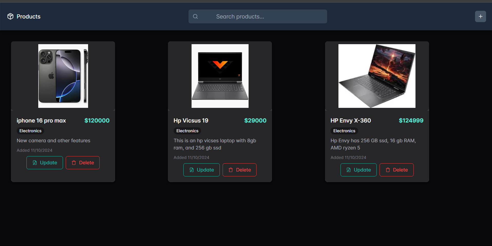

# Product Management System

A modern web application for managing products, built with React and Node.js.

## 👨‍💻 Author
- **Name:** Onesmus Bett
- **Email:** onesmuskipchumba5@gmail.com
- **GitHub:** [onesmuskipchumba0](https://github.com/onesmuskipchumba0)

## 🚀 Features
- Create, Read, Update, and Delete products
- Search functionality
- Responsive design
- Dark theme
- Real-time updates
- User-friendly interface

## 🛠️ Technologies Used
- React.js
- Node.js
- Express.js
- MongoDB
- Chakra UI
- Tailwind CSS
- Axios
- React Router DOM

## 📦 Installation

1. Clone the repository

```bash
git clone https://github.com/onesmuskipchumba0/MERN.git
cd MERN
```

2. Install dependencies for frontend
```bash
cd frontend
npm install
```

3. Install dependencies for backend
```bash
cd backend
npm install
```

4. Create a `.env` file in the backend directory and add:
```env
MONGODB_URI=your_mongodb_connection_string
PORT=5000
```

5. Start the development servers

Backend:
```bash
npm run server
```

Frontend:
```bash
npm run client
```

## 🌟 Usage

1. **View Products**: Browse all products on the home page
2. **Create Product**: Click the '+' button to add a new product
3. **Update Product**: Click on a product to edit its details
4. **Delete Product**: Use the delete button on each product card
5. **Search**: Use the search bar to find specific products

## 📱 Screenshots




## 🤝 Contributing

Contributions, issues, and feature requests are welcome! Feel free to check [issues page](https://github.com/onesmuskipchumba0/MERN/issues).

## 📝 License

This project is [MIT](LICENSE) licensed.

## 📞 Contact

For any questions or feedback, please reach out:
- Email: onesmuskipchumba5@gmail.com
- GitHub: [@onesmuskipchumba0](https://github.com/onesmuskipchumba0)

---
Made with ❤️ by Onesmus Bett
```
